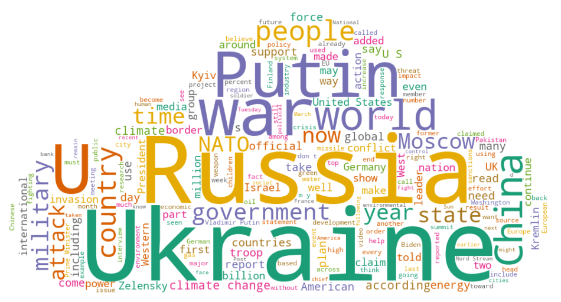

# Multilingual Entity Framing (Narrative Role Classification)

This work solves the first subtask of [Semeval NLP 2025](https://propaganda.math.unipd.it/semeval2025task10/) (last accessed 21/02/2025) and was developed as part of a university NLP lecture from November 2024 to January 2025 with another student.

# Task Definition
Given a news article and a list of mentions of named entities (NEs) in the article, assign for each such mention one or more roles using a predefined taxonomy of fine-grained roles covering three main type of roles: protagonists, antagonists, and innocent. This is a multi-label multi-class text-span classification task.

# Input
- News Article
- Entity mention
- Offset

## Tasks
1. Dataset analysis and pre-processing (focus on two languages: English (EN) and Portuguese (PT))
2. Transformer-based approach -> RoBERTa, XLNet, LLM
3. Evaluation Metrics (Accuracy, macro F1, micro F1, Exact Match Ratio (EMR))


The articles are about two topics, the Ukraine-Russia war and Climate Change:
<p align="center">
  
</p>

## Setup
```bash
python3 -m venv env
source env/bin/activate
pip install --upgrade pip
pip install -r requirements.txt
```
## How to run RoBERTa approach
### Training and prediction
```bash
python run.py --train_file [path_to_training_set] --dev_file [path_to_test_set] --output_dir [path_to_logging_dir] --model_name [architecture]
```
Example:
```bash
python run.py --train_file dataset/combined/subtask-1-annotations.txt --dev_file dataset/dev_4_december/EN/subtask-1-annotations.txt --output_dir output/RoBERTa/EN --model_name roberta
```
### Scorer
```bash
python scorer.py --gold_file_path [path/to/gold.tsv] --pred_file_path [path/to/pred.tsv]
```
To log the output to a file in addition to the console:
```bash
python scorer.py -g path/to/gold.tsv -p path/to/pred.tsv -l
```

## How to run LLM approach
### Use the generated context with the extracted sentence or only the extracted sentence
```bash
python models/llm/llm_context.py
```
### Use the original article for prediction
```bash
python models/llm/llm_article.py
```

### LLM Models
- Llama-3.2 3B
- Llama-3.2 1B
- Llama-3.1 8B

### Setup TabbyAPI for fast inference
How to setup tabbyAPI: https://github.com/theroyallab/tabbyAPI/wiki/01.-Getting-Started \
Ensure TabbyAPI is running locally or update the API URL in the code.
1. git clone https://github.com/theroyallab/tabbyAPI
2. cd tabbyAPI/
3. ./start.sh
4. add key to config.env

### Key parameters that can be configured in config/config.env:

- `TABBY_API_KEY`: api key for running the api locally
- `LANGUAGE`: English (EN) or Portuguese (PT) dataset
- `CONTEXT`: adding additional context for the extracted sentence (CONTEXT=1) or just using the sentence for prediction (CONTEXT=0) (default: 1)
- `IN_CONTEXT_LEARNING`: whicht in-context learning strategy you want to apply (zero-shot=0, one-shot=1, few-shot=2, chain-of-thought=3) (default: 0)
