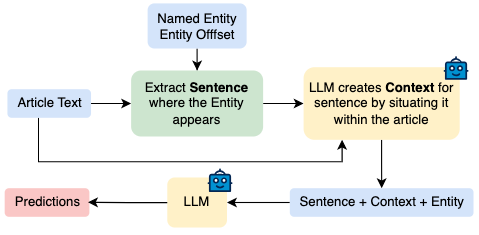

# LLM Pipeline

Different input variations for the LLM are tested:
1. Give the whole article and the entity with its span to the LLM. The LLM is prompted to classify the entity based on the whole article.
2. Extract sentence where the Entity appears in the article and create an additional context by using an LLM for this sentence based on the article. The sentence and context is used as input for the LLM for the final prediction.

Overview of this work's LLM with context pipeline (second method) for solving the task of narrative role classification:

  

Additionally, different prompting strategies (in-context learning) are evaluated for each method:
- Zero-shot
- One-shot
- Few-shot